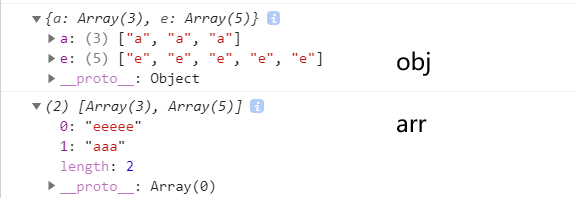

# 基于JS的功能实现


## 1  基于对象的出现频率统计法

### 1.1  451_字符串出现次数统计并输出

```js
		//--- 2.1 创造对象
		for (let a of s) {
            if (obj[a] !== undefined) {
                obj[a].push(a); //更改此处为 obj[a]++ 进行计数
            } else {
                obj[a] = [a];   //更改此处为 obj[1] 进行计数初始化
            }
            //console.log(obj[a])
        }

        //--- 2.2 取出所有对象的值
        let arr = Object.values(obj);	//这个办法的核心
        console.log(obj);
        console.log(arr);
```

> 输出结果例：
>
> 

 