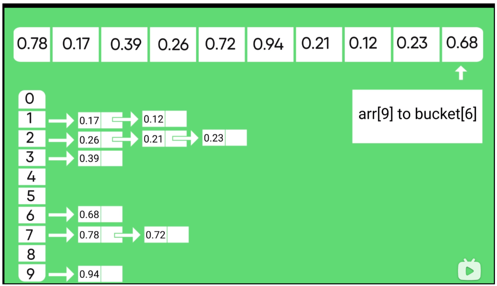
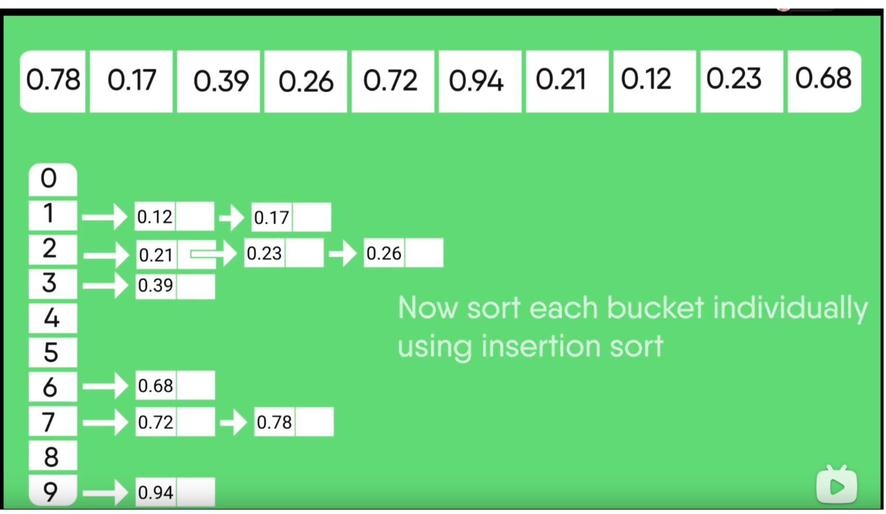
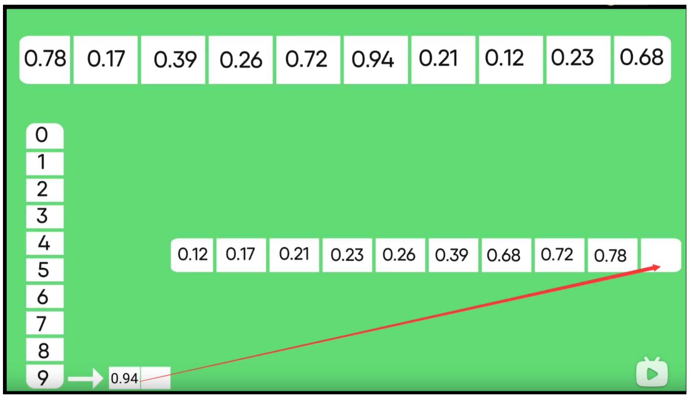

 # 桶排序

## 1 视频

https://www.bilibili.com/video/BV1gf4y1B7Ev?p=10

https://www.bilibili.com/video/BV15W411B7YZ?from=search&seid=55499920606971384892 

##  2  算法

### 2.1 针对桶，设置范围，将数据放入桶里

### 2.2 对桶内数据进行排序

### 2.3 将各个桶的数据结合起来，还原成原本的数组

## 3 分析：

### 3.1 时间复杂度

* 好 O( n+k )  //每个数据都有一个桶
* 坏 O ( n² )  //只有一个桶

### 3.2 空间

* O ( n+k ) //k个数据n个桶

### 3.3 稳定性

* 标准答案：稳定
* up的理解：与桶内的排序有关，如果桶内是用快速排序这种不稳定的算法的话，自然是不稳定的。

## 常见问题的通用解法

### 原理

* Map 存储 字符和频率

* 扔进数组用下标作为频率 

*  倒序输出拼接字符串用

  